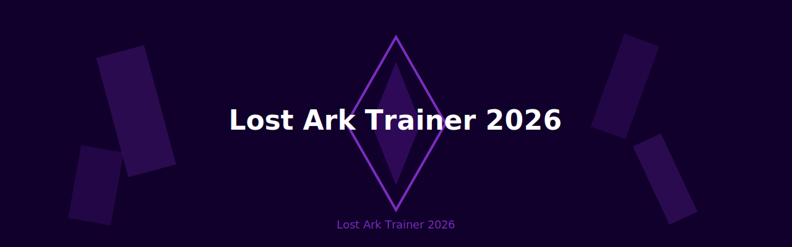
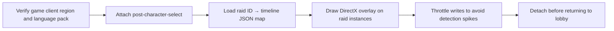

<details open>
<summary><strong>Lost Ark Trainer 2026 — expand overview</strong></summary>
<br/>
Lost Ark Trainer 2026 - Cooldown Assist, Resource Freeze, Speed Boost, Boss Timeline
<br/><br/>
[](https://github.com/topics/windows) [](https://github.com/topics/gaming) [](https://github.com/topics/gaming) [](.github/workflows/auto-commit.yml) [](LICENSE)
</details>

<p align="center"></p>

<details>
<summary><strong>Download & setup</strong></summary>

[](release_url)

1. Open [**Releases**](release_url) or use the button below
2. Download the archive and unpack anywhere
3. Start **Lost Ark**, then launch the unpacked application
4. Bypass SmartScreen via **More info → Run anyway** if prompted
5. Press **F8** to open the overlay

</details>

<details>
<summary><strong>Feature matrix</strong></summary>

| Toggle | What it does |
|:--|:--|
| **Cooldown Assist** | Display skill cooldown overlay with optional reset |
| **Resource Freeze** | Pause combat resource drain during raids |
| **Speed Boost** | Adjust animation speed multiplier safely |
| **Boss Timeline** | Show mechanic timeline bars for current encounter |

</details>

<details>
<summary><strong>Execution graph</strong></summary>



</details>

<details>
<summary><strong>Directory tree</strong></summary>

```
lost-ark-trainer-2026/
├── toolkit/
│   ├── host/               # Raid host + safe detach
│   ├── raid/               # Timeline deck
│   ├── combat/             # Cooldowns + resources
│   └── ui/                 # Glass overlay
├── presets/raids/
├── images/
│   └── shard-cover.svg
├── button.svg
├── desc.txt
├── name.txt
├── topics.txt
├── .github/sync/pulse.txt
├── .github/workflows/auto-commit.yml
├── CHANGELOG.md
└── LICENSE
```

</details>

<details>
<summary><strong>FAQ</strong></summary>

**SmartScreen warning?**  
Unsigned build — inspect source or compile yourself.

**Supported build?**  
Latest **Lost Ark** Steam build (2026). Raid timelines are defined under `presets/raids/`.

**Dependencies?**  
None — standalone Windows x64 package.

**Will my account be flagged?**  
Use on private practice raids only. Public matchmaking is not supported.

**Steam vs Amazon client?**  
Both clients share the same offset profile in `presets/raids/index.json`.

</details>

[LICENSE](LICENSE)
